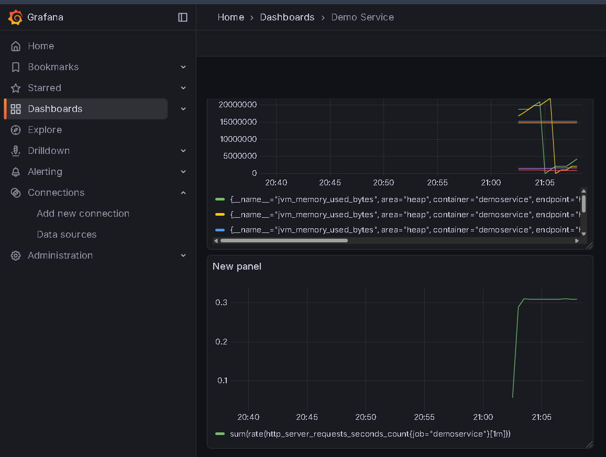
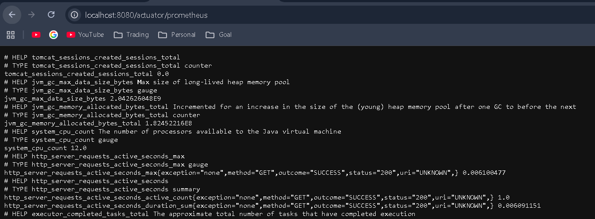
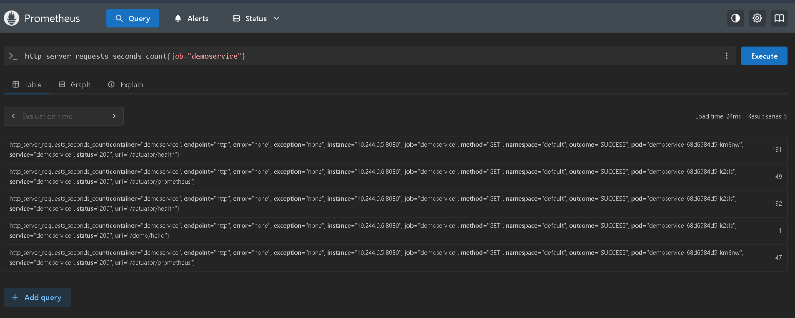

# Prometheus + Grafana + Spring Boot Micrometer Hands-On (KIND on Windows)

This repository contains a complete end-to-end hands-on guide to monitor
a Java Spring Boot microservice using **Prometheus**, **Grafana**, and
**Micrometer**, all running on a **Kubernetes cluster created with KIND
(Kubernetes-in-Docker)** on a Windows machine.

**For Grafana, we can download readymade dashboard templates**





------------------------------------------------------------------------

# 📌 Prerequisites

Install the following tools:

| Tool | Purpose |
|------|---------|
| **Docker Desktop** | Required for KIND |
| **KIND** | Kubernetes-in-Docker |
| **kubectl** | Kubernetes CLI |
| **Helm 3** | Install Prometheus & Grafana |
| **Java 17 + Maven** | Build microservice |

------------------------------------------------------------------------

## 🚀 1. Install KIND on Windows

### Option 1 --- Install with Chocolatey (recommended)

    choco install kind
    kind version

### Create a Kubernetes cluster

    kind create cluster --name myk8s
    kubectl get nodes

------------------------------------------------------------------------

## 🚀 2. Create Spring Boot Microservice

### Dependencies in `pom.xml`

``` xml
<dependency>
    <groupId>org.springframework.boot</groupId>
    <artifactId>spring-boot-starter-web</artifactId>
</dependency>
<dependency>
    <groupId>org.springframework.boot</groupId>
    <artifactId>spring-boot-starter-actuator</artifactId>
</dependency>
<dependency>
    <groupId>io.micrometer</groupId>
    <artifactId>micrometer-registry-prometheus</artifactId>
</dependency>
```
## Controller Code

``` java
@RestController
@RequestMapping("/demo")
public class WebController {

    @GetMapping("/hello")
    public String hello() {
        return "Hello from Microservice!";
    }
}
```

------------------------------------------------------------------------

## ⚙️ 3. Enable Prometheus Metrics (Micrometer)

### `prom-values.yaml`

``` yaml
spring:
  application:
    name: webapplication
server:
  port: 8080

management:
  endpoints:
    web:
      exposure:
        include: health,info,prometheus
    prometheus:
      enabled: true
  metrics:
    export:
      prometheus:
        enabled: true
```
------------------------------------------------------------------------

## 🐳 4. Create Docker Image

### Dockerfile

``` dockerfile
FROM eclipse-temurin:17-jdk-alpine
VOLUME /tmp
COPY target/demoservice-1.0.jar app.jar
ENTRYPOINT ["java","-jar","/app.jar"]
```

### Build & Load image into KIND

    mvn clean package -DskipTests
    docker build -t demoservice:1.0 .
    kind load docker-image demoservice:1.0 --name myk8s

------------------------------------------------------------------------

## ☸️ 5. Deploy to Kubernetes

### Deployment + Service YAML
File `microservice-deployment.yaml`
``` yaml
apiVersion: apps/v1
kind: Deployment
metadata:
  name: demoservice
  labels:
    app: demoservice
spec:
  replicas: 2
  selector:
    matchLabels:
      app: demoservice
  template:
    metadata:
      labels:
        app: demoservice
    spec:
      containers:
        - name: demoservice
          image: demoservice:1.0
          imagePullPolicy: IfNotPresent
          ports:
            - containerPort: 8080
          readinessProbe:
            httpGet:
              path: /actuator/health
              port: 8080
            initialDelaySeconds: 5
            periodSeconds: 10
---
apiVersion: v1
kind: Service
metadata:
  name: demoservice
  labels:
    app: demoservice
  annotations:
    prometheus.io/scrape: "true"
    prometheus.io/port: "8080"
    prometheus.io/path: "/actuator/prometheus"
spec:
  selector:
    app: demoservice
  ports:
    - name: http
      port: 8080
      targetPort: 8080
  type: ClusterIP
```

Apply:

    kubectl apply -f deployment.yaml
    kubectl get pods

### Test locally

    kubectl port-forward svc/demoservice 8080:8080
    http://localhost:8080/demo/hello
    http://localhost:8080/actuator/prometheus

------------------------------------------------------------------------

## 📡 6. Install Prometheus + Grafana using Helm

    helm repo add prometheus-community https://prometheus-community.github.io/helm-charts
    helm repo add grafana https://grafana.github.io/helm-charts
    helm repo update

Install stack:

    helm install kp-stack prometheus-community/kube-prometheus-stack --create-namespace -n monitoring

Check pods:

    kubectl get pods -n monitoring

------------------------------------------------------------------------

## 📈 7. Create ServiceMonitor for Microservice

### `servicemonitor.yaml`

``` yaml
apiVersion: monitoring.coreos.com/v1
kind: ServiceMonitor
metadata:
  name: demoservice-sm
  namespace: monitoring
  labels:
    release: kp-stack
spec:
  selector:
    matchLabels:
      app: demoservice
  namespaceSelector:
    matchNames:
      - default
  endpoints:
    - port: http
      path: /actuator/prometheus
      interval: 15s
```

Apply:

    kubectl apply -f servicemonitor.yaml

------------------------------------------------------------------------

## 🔍 8. Access Prometheus

    kubectl -n monitoring port-forward svc/kp-stack-prometheus 9090:9090

Open:\
http://localhost:9090

### Example Queries

-   Check target UP:

```{=html}
<!-- -->
```
    up{job="demoservice"}

-   JVM Heap:

```{=html}
<!-- -->
```
    jvm_memory_bytes_used{area="heap"}

------------------------------------------------------------------------

## 📊 9. Access Grafana

    kubectl -n monitoring port-forward svc/kp-stack-grafana 3000:80

Open: http://localhost:3000

### Get credentials:

    kubectl get secret -n monitoring kp-stack-grafana -o jsonpath="{.data.admin-user}" | base64 --decode
    kubectl get secret -n monitoring kp-stack-grafana -o jsonpath="{.data.admin-password}" | base64 --decode

------------------------------------------------------------------------

## 📌 10. Create Dashboard in Grafana

### Example PromQL for HTTP request counts:

    sum(rate(http_server_requests_seconds_count[1m])) by (uri)

### JVM Heap Memory

    jvm_memory_bytes_used{area="heap"}

### CPU Usage

    rate(process_cpu_seconds_total[1m])

------------------------------------------------------------------------

## ✅ Final Outcome

You now have:

✔ A running Spring Boot microservice\
✔ Exposing Prometheus metrics with Micrometer\
✔ Scraped automatically by Prometheus Operator\
✔ Visible in Prometheus UI\
✔ Grafana dashboards showing JVM + HTTP metrics

------------------------------------------------------------------------

### 🎉 You have completed a production-grade monitoring stack on your local laptop using KIND!

Enjoy exploring and expanding!
